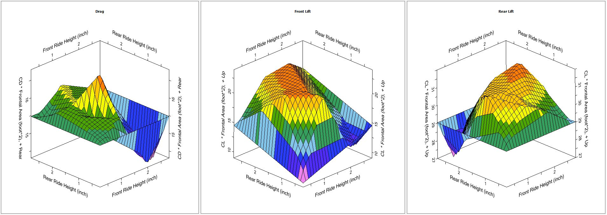

# AER file writer for LTS aero mapping

This script takes an excel document with front downforce, rear downforce, and drag for multiple ride heights and spits out an .aer file, readable by LTS.

↑ an example of what your aero map should not look like...

---

### Here's what you need to do:

 1. Edit the xlsx document to include your downforce and drag numbers
	 * In order for matlab to interpolate the data, you need to make sure that you cover all of your bases in terms or ride heights. This means that in addition to have your sim numbers, you need to include the x and y (ride height) maximums and minimums. For example if my maximum tested ride height is 2.5in, and my minimum was 0.5 inches, I would need to include downforce/drag numbers for the following ride hight combinations:
		 * 0.5" front x 0.5" rear
		 * 0.5" front x 2.5" rear
		 * 2.5" front x 2.5" rear
		 * 2.5" front x 0.5" rear
	 * If you do not run the max and min numbers in CFD, be sure to include semi-accurate guestimates, or else the boundary conditions will be wack and your LTS sim might crash

 2. In MATLAB, the parameters that you will/may need to change include:
	 * line 2: f_out_path
		 * Where the .aer file will be saved and with what name
	 * line 5: f_in_path
		 * Where the xlsx file is located and it's name
	 * line 11: tabs
		 * you probably don't need to mess with this one
	 * line 12: table_ranges
		 * depending on the number of values you have, you will probably have to mess with these table ranges
	 * line 20: start_rh
		 * The ride height for which you have the minimum value for
	 * line 21: stop_rh
		 * The ride height for which you have the maximum value for
	 * line 22: step_rh
		 * The step in inches for which you want the interpolated values to be calculated. You probably don't have to mess with this one too much, either.

 3. Once you run the script and the .aer file is generated, you are then free to sauce it into LTS
	 * Be sure that the scaling coefficients are all initially set to 1, and that you import it with the reference speed what your CFD.

