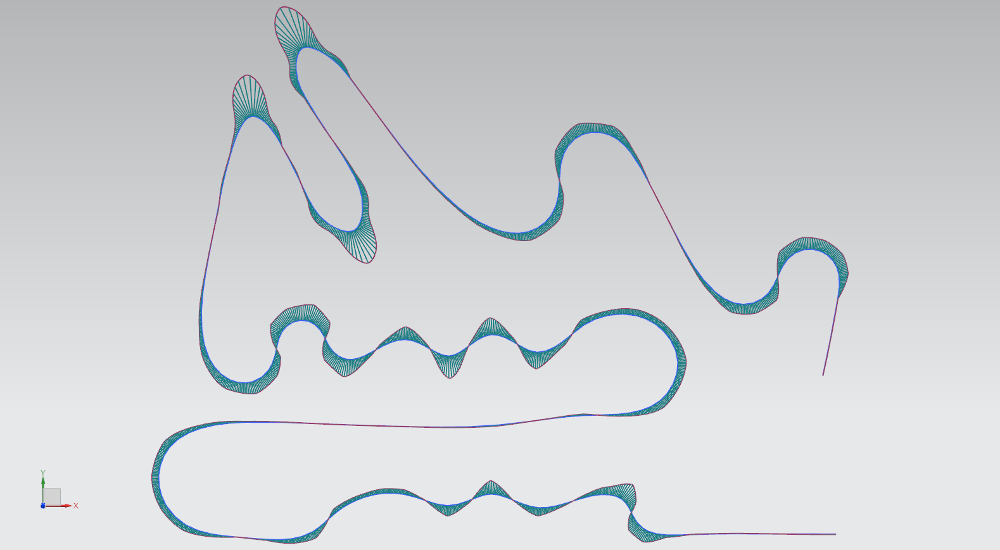

# LTS Track Creation

This file outlines how to create a track to import into LTS. It's pretty straight forward, but you'll need to know what scripts to use and how to use them.

---

### Here's what you need to do:

1. Import your track map to NX. Menu → Insert → Datum/Point → Raster Image
2. Scale your track map. There's really no right or wrong way to do this, and it usually depends on what markings are on the track map itself. However, you will need to make sure that every foot in real life is equal to one inch in NX. For example, if slaloms are 30 feet apart, you must make sure that they are 30 inches apart in your map.
3. On a sketch that's on the same plane as the raster image, you're going to trace the driving line with a Studio Spline. Be sure to make sure that the spline is smooth by using the Show Combs function.
4. Next, we need to create points to mimic the points that a GPS module spits out. Menu → Insert → Datum/Point → Point Set. Select your spline and enter the desired amount of points. LTS always likes more points, so don't be afraid to sauce in a big number. I think that the autocross tracks that I've been working with did best with 8,000 points or more. We're working with computers here. They can handle it.
5. Once you are satisfied with your map in NX, it's time to use the scripts to get them into a format that LTS can use. The first script that you're probably gonna want to edit is the `points_extractor.vb` script. The only thing that you need to change is the file path on line 31. This is where NX will spit out the temporary file that the python script, `TXT_to_DL1GPS.py`, will use to create the LTS file. Out of convenience, it's probably best to change that file path to whevever the Visual Basic and Python scripts are located, because the Python script looks in the parent directory for the `temp.txt` file by default.
6. In NX, Menu → Tools → Journal → Run. Browse to wherever the `points_extractor.vb` script is located and select it.
7. There will be a dialog box that pops up. Either click on the points set in the model view, or the model history window. Your points are now extracted to the `temp.txt` file!
8. Now for the Python script. If the `temp.txt` file was saved into the same directory as where the python script is located, there's no need to change line 18, `text_file_location`. However, if the file was saved elsewhere, you're gonna want to assign the file path to that variable
9. You can change `output_file_location` on line 21 to wherever you want, but make sure that it's a `.csv` file, and that it's in an easy spot to find. This will be the file that you import into LTS.
10. `reverse_track_bool` shouldn't need to be changed, however, if you drew your spline backwards or the map in LTS imported as backwards, this line is here to change the direction of the GPS output.
11. Once all of the variables are updated, you can run the file to generate your DL1 file.
12. In LTS under the track tab, you can import the csv file as a DL1 GPS file. From there, you may have to do a little bit of filtering. The LTS manual has more about this.

#### Adjusting WUSS factor

The WUSS factor is basically how well the driver can push the tire to the peak slip while undergoing a braking maneuver. For slaloms, you can use the WUSS spline to set the factor to 0, making the car model behave more accurately to how our drivers actually drive slaloms. Setting WUSS to 0 essentially means the driver is unable to push the tires to any slip, coasting through anything in that range. You don't have to worry about squaring the spline all that much, because it should solve fine, but raising the cutoff frequency should help. Also, ensure that the Wuss Factor method is set to longitudinal capability, as the solver is more stable that way.
